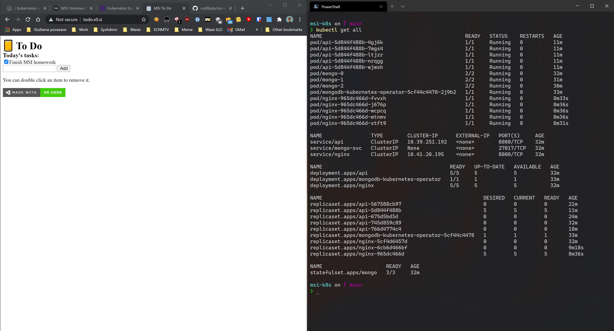

# K8S todo

## Install
Make sure you have authenticated to [GitHub Container Repository](https://ghcr.io/) and added the personal access to your docker config.json. This project also requires the [MongoDB Operator](https://github.com/mongodb/mongodb-kubernetes-operator/blob/master/docs/install-upgrade.md) which is installed in the submodule k8s-mongo. Make sure to run `git submodule update --init`.

```bash
# Set the registry credentials for the Docker Registry on GitHub
kubectl -n todo create secret docker-registry regcred --docker-server=ghcr.io --docker-username=<github-username> --docker-password=<github-personal-access-token>
# Get git submodules working, you can also clone with the --recurse-submodules flag
git submodule update --init --recursive
# First time install the CRD for mongo operator, also run this then the submodule is updated
kubectl create -f k8s-mongo/deploy/crds/mongodb.com_mongodb_crd.yaml
# Deploy the mongo operator
kubectl apply -f k8s-mongo/deploy/operator
kubectl apply -f k8s
```

## App access
You can find the current version of the app at [todo.v0.si](http://todo.v0.si/). It will be up until **Feb 2nd 2021**.

## Notes
For some reason the mongo operator does not start inside of minikube for me. You results may vary. 

## Screenshots
